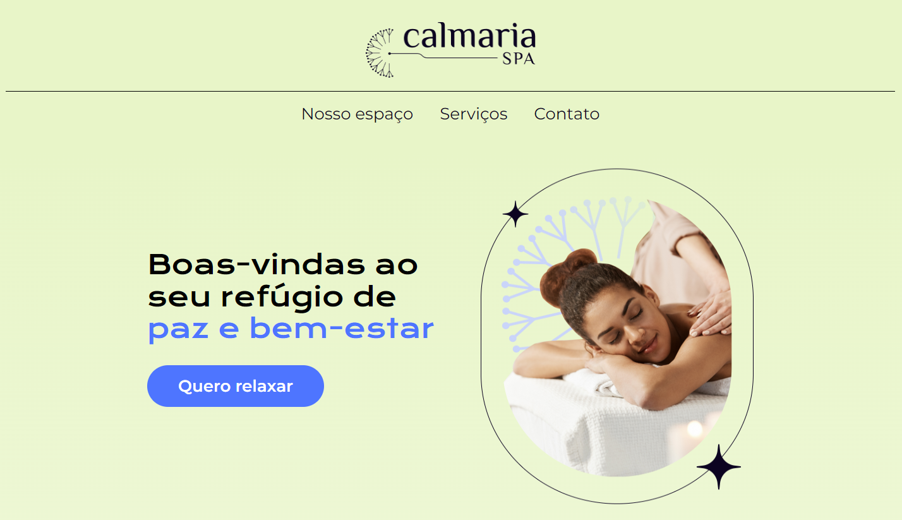

# Calmaria Spa

## Técnicas e tecnologias utilizadas

- `HTML`
- `CSS`
- `Acessibilidade Web`
- `Figma`

## Mais informações sobre o projeto

A ideia principal é evoluir ainda mais os conhecimentos em Acessibilidade Web com foco em CSS. 
